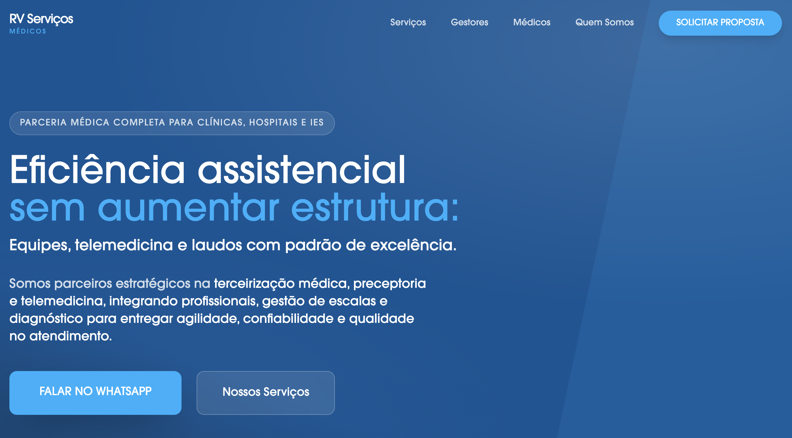

# Rv-Servicos

## Preview do site

## Requisitos

- Node.js (recomendado 18+)
- npm ou pnpm

## Como rodar localmente

1. Instale as dependencias:
   `npm install`
2. Configure a chave da API do Gemini em `.env.local`:
   `GEMINI_API_KEY=seu_token_aqui`
3. Inicie o servidor de desenvolvimento:
   `npm run dev`

## Scripts

- `npm run dev` inicia o ambiente de desenvolvimento
- `npm run build` gera o build de producao
- `npm run preview` visualiza o build localmente

## Estrutura basica

- `App.tsx` componente principal
- `components/` componentes reutilizaveis
- `assets/` recursos estaticos
- `index.css` estilos globais
- `vite.config.ts` configuracao do Vite

## Deploy

Se voce ja tem o app publicado no AI Studio, use o link acima para visualizar a versao hospedada.
Para publicar fora do AI Studio, gere o build (`npm run build`) e hospede o conteudo da pasta `dist/`.
